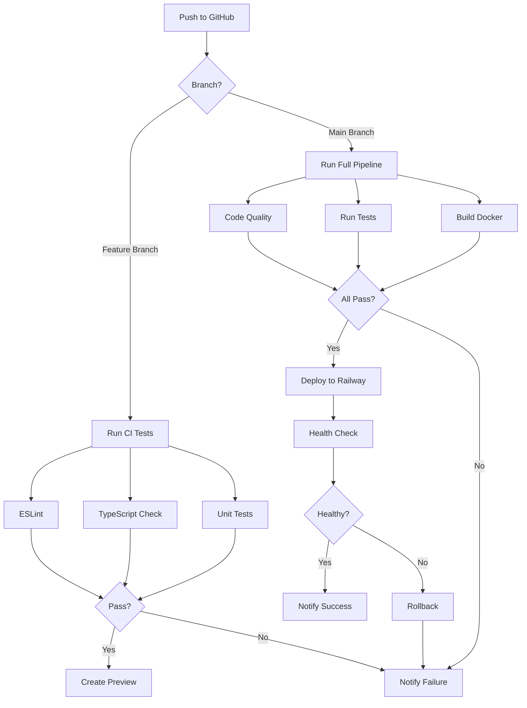

# 🔄 CI/CD Pipeline with GitHub Actions

**Automated testing, building, and deployment for your Next.js app**

---

## 📋 Table of Contents

1. [GitHub Actions Workflows](#github-actions-workflows)
2. [Automated Testing](#automated-testing)
3. [Docker Build & Push](#docker-build--push)
4. [Railway Deployment](#railway-deployment)
5. [Environment Secrets](#environment-secrets)
6. [Best Practices](#best-practices)

---

## 🚀 Complete CI/CD Pipeline

### Overview

```
┌─────────────────────────────────────────────────────┐
│  Git Push to GitHub                                 │
└───────────────┬─────────────────────────────────────┘
                │
                ▼
┌─────────────────────────────────────────────────────┐
│  GitHub Actions Triggered                           │
└───────────────┬─────────────────────────────────────┘
                │
                ├─► Lint Code (ESLint)
                │
                ├─► Type Check (TypeScript)
                │
                ├─► Run Tests (Jest)
                │
                ├─► Build Docker Image
                │
                ├─► Push to Docker Hub (optional)
                │
                └─► Deploy to Railway
                    │
                    ▼
                  SUCCESS ✅
```

---

## 📝 GitHub Actions Workflow Files

### Create Workflow Directory

```bash
mkdir -p .github/workflows
```

---

## 🔧 Workflow 1: CI - Test & Build

**Create**: `.github/workflows/ci.yml`

```yaml
name: CI - Test & Build

on:
  push:
    branches: [main, develop, optimised]
  pull_request:
    branches: [main, develop]

env:
  NODE_VERSION: '20'

jobs:
  # ==========================================
  # Job 1: Code Quality Checks
  # ==========================================
  quality:
    name: Code Quality
    runs-on: ubuntu-latest
    
    steps:
      - name: 📥 Checkout code
        uses: actions/checkout@v4

      - name: 🟢 Setup Node.js
        uses: actions/setup-node@v4
        with:
          node-version: ${{ env.NODE_VERSION }}
          cache: 'npm'

      - name: 📦 Install dependencies
        run: npm ci

      - name: 🔍 Run ESLint
        run: npm run lint

      - name: 📝 TypeScript type check
        run: npx tsc --noEmit

  # ==========================================
  # Job 2: Run Tests
  # ==========================================
  test:
    name: Run Tests
    runs-on: ubuntu-latest
    needs: quality
    
    steps:
      - name: 📥 Checkout code
        uses: actions/checkout@v4

      - name: 🟢 Setup Node.js
        uses: actions/setup-node@v4
        with:
          node-version: ${{ env.NODE_VERSION }}
          cache: 'npm'

      - name: 📦 Install dependencies
        run: npm ci

      - name: 🧪 Run tests
        run: npm test -- --coverage
        env:
          NODE_ENV: test

      - name: 📊 Upload coverage reports
        uses: codecov/codecov-action@v4
        if: success()
        with:
          files: ./coverage/lcov.info
          flags: unittests
          name: codecov-umbrella
          fail_ci_if_error: false

  # ==========================================
  # Job 3: Build Application
  # ==========================================
  build:
    name: Build Next.js
    runs-on: ubuntu-latest
    needs: [quality, test]
    
    steps:
      - name: 📥 Checkout code
        uses: actions/checkout@v4

      - name: 🟢 Setup Node.js
        uses: actions/setup-node@v4
        with:
          node-version: ${{ env.NODE_VERSION }}
          cache: 'npm'

      - name: 📦 Install dependencies
        run: npm ci

      - name: 🏗️ Build application
        run: npm run build
        env:
          NODE_ENV: production
          SKIP_ENV_VALIDATION: true

      - name: 💾 Cache build
        uses: actions/cache@v4
        with:
          path: |
            .next/cache
            .next/standalone
            .next/static
          key: ${{ runner.os }}-nextjs-${{ hashFiles('package-lock.json') }}-${{ hashFiles('**/*.js', '**/*.jsx', '**/*.ts', '**/*.tsx') }}
          restore-keys: |
            ${{ runner.os }}-nextjs-${{ hashFiles('package-lock.json') }}-

  # ==========================================
  # Job 4: Security Scan
  # ==========================================
  security:
    name: Security Scan
    runs-on: ubuntu-latest
    needs: quality
    
    steps:
      - name: 📥 Checkout code
        uses: actions/checkout@v4

      - name: 🔒 Run npm audit
        run: npm audit --audit-level=high
        continue-on-error: true

      - name: 🔍 Run Snyk security scan
        uses: snyk/actions/node@master
        continue-on-error: true
        env:
          SNYK_TOKEN: ${{ secrets.SNYK_TOKEN }}
        with:
          args: --severity-threshold=high
```

---

## 🐳 Workflow 2: Docker Build & Push

**Create**: `.github/workflows/docker.yml`

```yaml
name: Docker Build & Push

on:
  push:
    branches: [main]
    tags:
      - 'v*'
  workflow_dispatch:

env:
  DOCKER_IMAGE: ${{ secrets.DOCKER_USERNAME }}/my-todo-app
  PLATFORMS: linux/amd64,linux/arm64

jobs:
  # ==========================================
  # Build and Push Docker Image
  # ==========================================
  docker:
    name: Build & Push Docker Image
    runs-on: ubuntu-latest
    
    steps:
      - name: 📥 Checkout code
        uses: actions/checkout@v4

      - name: 🐳 Set up Docker Buildx
        uses: docker/setup-buildx-action@v3

      - name: 🔑 Login to Docker Hub
        uses: docker/login-action@v3
        with:
          username: ${{ secrets.DOCKER_USERNAME }}
          password: ${{ secrets.DOCKER_PASSWORD }}

      - name: 📝 Extract metadata
        id: meta
        uses: docker/metadata-action@v5
        with:
          images: ${{ env.DOCKER_IMAGE }}
          tags: |
            type=ref,event=branch
            type=ref,event=pr
            type=semver,pattern={{version}}
            type=semver,pattern={{major}}.{{minor}}
            type=sha,prefix={{branch}}-
            type=raw,value=latest,enable={{is_default_branch}}

      - name: 🏗️ Build and push Docker image
        uses: docker/build-push-action@v5
        with:
          context: .
          file: ./Dockerfile
          platforms: ${{ env.PLATFORMS }}
          push: true
          tags: ${{ steps.meta.outputs.tags }}
          labels: ${{ steps.meta.outputs.labels }}
          cache-from: type=registry,ref=${{ env.DOCKER_IMAGE }}:buildcache
          cache-to: type=registry,ref=${{ env.DOCKER_IMAGE }}:buildcache,mode=max
          build-args: |
            NODE_ENV=production
            NEXT_TELEMETRY_DISABLED=1

      - name: 📊 Image digest
        run: echo ${{ steps.docker_build.outputs.digest }}

      - name: 🔍 Scan image for vulnerabilities
        uses: aquasecurity/trivy-action@master
        with:
          image-ref: ${{ env.DOCKER_IMAGE }}:latest
          format: 'sarif'
          output: 'trivy-results.sarif'
          severity: 'CRITICAL,HIGH'

      - name: 📤 Upload Trivy scan results
        uses: github/codeql-action/upload-sarif@v3
        if: always()
        with:
          sarif_file: 'trivy-results.sarif'
```

---

## 🚂 Workflow 3: Deploy to Railway

**Create**: `.github/workflows/deploy.yml`

```yaml
name: Deploy to Railway

on:
  push:
    branches: [main]
  workflow_dispatch:

jobs:
  # ==========================================
  # Deploy to Railway Production
  # ==========================================
  deploy:
    name: Deploy to Production
    runs-on: ubuntu-latest
    environment:
      name: production
      url: ${{ steps.deploy.outputs.url }}
    
    steps:
      - name: 📥 Checkout code
        uses: actions/checkout@v4

      - name: 🚂 Install Railway CLI
        run: npm install -g @railway/cli

      - name: 🚀 Deploy to Railway
        id: deploy
        run: |
          railway link ${{ secrets.RAILWAY_PROJECT_ID }}
          railway up --detach
          echo "url=https://${{ secrets.RAILWAY_DOMAIN }}" >> $GITHUB_OUTPUT
        env:
          RAILWAY_TOKEN: ${{ secrets.RAILWAY_TOKEN }}

      - name: ✅ Deployment successful
        run: |
          echo "🎉 Deployment successful!"
          echo "🌐 URL: ${{ steps.deploy.outputs.url }}"

      - name: 🔔 Notify on success
        if: success()
        uses: 8398a7/action-slack@v3
        with:
          status: custom
          custom_payload: |
            {
              text: "✅ Deployment to Railway successful!",
              attachments: [{
                color: 'good',
                text: `Branch: ${{ github.ref }}\nCommit: ${{ github.sha }}\nURL: ${{ steps.deploy.outputs.url }}`
              }]
            }
        env:
          SLACK_WEBHOOK_URL: ${{ secrets.SLACK_WEBHOOK }}

      - name: 🔔 Notify on failure
        if: failure()
        uses: 8398a7/action-slack@v3
        with:
          status: custom
          custom_payload: |
            {
              text: "❌ Deployment to Railway failed!",
              attachments: [{
                color: 'danger',
                text: `Branch: ${{ github.ref }}\nCommit: ${{ github.sha }}`
              }]
            }
        env:
          SLACK_WEBHOOK_URL: ${{ secrets.SLACK_WEBHOOK }}
```

---

## 🌿 Workflow 4: Preview Deployments

**Create**: `.github/workflows/preview.yml`

```yaml
name: Preview Deployment

on:
  pull_request:
    types: [opened, synchronize, reopened]

jobs:
  # ==========================================
  # Deploy PR Preview
  # ==========================================
  preview:
    name: Deploy Preview
    runs-on: ubuntu-latest
    environment:
      name: preview-${{ github.event.number }}
      url: ${{ steps.deploy.outputs.url }}
    
    steps:
      - name: 📥 Checkout code
        uses: actions/checkout@v4

      - name: 🚂 Install Railway CLI
        run: npm install -g @railway/cli

      - name: 🚀 Deploy preview
        id: deploy
        run: |
          railway link ${{ secrets.RAILWAY_PROJECT_ID }}
          railway up --detach --environment preview-${{ github.event.number }}
          echo "url=https://pr-${{ github.event.number }}-${{ secrets.RAILWAY_DOMAIN }}" >> $GITHUB_OUTPUT
        env:
          RAILWAY_TOKEN: ${{ secrets.RAILWAY_TOKEN }}

      - name: 💬 Comment on PR
        uses: actions/github-script@v7
        with:
          script: |
            github.rest.issues.createComment({
              issue_number: context.issue.number,
              owner: context.repo.owner,
              repo: context.repo.repo,
              body: `🚀 Preview deployment ready!\n\n🌐 **URL**: ${{ steps.deploy.outputs.url }}\n\n✅ This preview will be automatically destroyed when the PR is closed.`
            })
```

---

## 🔐 GitHub Secrets Setup

### Required Secrets

Go to GitHub → Settings → Secrets and variables → Actions → New repository secret

```
1. RAILWAY_TOKEN
   - Get from: railway.app → Account → Tokens
   - Value: railway_xxx...

2. RAILWAY_PROJECT_ID
   - Get from: railway.app → Project → Settings
   - Value: project_id_xxx...

3. RAILWAY_DOMAIN
   - Your Railway domain
   - Value: my-app.railway.app

4. DOCKER_USERNAME (optional)
   - Your Docker Hub username
   - Value: your_username

5. DOCKER_PASSWORD (optional)
   - Your Docker Hub password/token
   - Value: dckr_pat_xxx...

6. SNYK_TOKEN (optional)
   - For security scanning
   - Get from: snyk.io → Account Settings
   - Value: snyk_token_xxx...

7. SLACK_WEBHOOK (optional)
   - For deployment notifications
   - Get from: Slack → Apps → Incoming Webhooks
   - Value: https://hooks.slack.com/services/xxx...

8. MONGODB_URI (for tests)
   - Test database URI
   - Value: mongodb+srv://...

9. JWT_SECRET (for tests)
   - Test JWT secret
   - Value: test_secret_min_32_chars...
```

### How to Add Secrets

```bash
# Using GitHub CLI
gh secret set RAILWAY_TOKEN
# Paste your token when prompted

gh secret set RAILWAY_PROJECT_ID
gh secret set RAILWAY_DOMAIN
gh secret set DOCKER_USERNAME
gh secret set DOCKER_PASSWORD
```

---

## 🧪 Workflow 5: Automated Testing

**Create**: `.github/workflows/test.yml`

```yaml
name: Automated Tests

on:
  push:
    branches: [main, develop, optimised]
  pull_request:
    branches: [main, develop]
  schedule:
    # Run tests daily at 2 AM UTC
    - cron: '0 2 * * *'

jobs:
  # ==========================================
  # Unit Tests
  # ==========================================
  unit-tests:
    name: Unit Tests
    runs-on: ubuntu-latest
    strategy:
      matrix:
        node-version: [18, 20]
    
    steps:
      - name: 📥 Checkout code
        uses: actions/checkout@v4

      - name: 🟢 Setup Node.js ${{ matrix.node-version }}
        uses: actions/setup-node@v4
        with:
          node-version: ${{ matrix.node-version }}
          cache: 'npm'

      - name: 📦 Install dependencies
        run: npm ci

      - name: 🧪 Run unit tests
        run: npm test -- --coverage --maxWorkers=2
        env:
          NODE_ENV: test
          MONGODB_URI: ${{ secrets.MONGODB_URI }}
          JWT_SECRET: ${{ secrets.JWT_SECRET }}

      - name: 📊 Upload coverage
        uses: codecov/codecov-action@v4
        with:
          files: ./coverage/lcov.info
          flags: unit-${{ matrix.node-version }}

  # ==========================================
  # Integration Tests
  # ==========================================
  integration-tests:
    name: Integration Tests
    runs-on: ubuntu-latest
    
    services:
      mongodb:
        image: mongo:7
        ports:
          - 27017:27017
        options: >-
          --health-cmd "mongosh --eval 'db.adminCommand(\"ping\")'"
          --health-interval 10s
          --health-timeout 5s
          --health-retries 5
      
      redis:
        image: redis:7-alpine
        ports:
          - 6379:6379
        options: >-
          --health-cmd "redis-cli ping"
          --health-interval 10s
          --health-timeout 5s
          --health-retries 5
    
    steps:
      - name: 📥 Checkout code
        uses: actions/checkout@v4

      - name: 🟢 Setup Node.js
        uses: actions/setup-node@v4
        with:
          node-version: 20
          cache: 'npm'

      - name: 📦 Install dependencies
        run: npm ci

      - name: 🧪 Run integration tests
        run: npm run test:integration
        env:
          NODE_ENV: test
          MONGODB_URI: mongodb://localhost:27017/test
          REDIS_URL: redis://localhost:6379
          JWT_SECRET: test_secret_min_32_chars_long_for_testing

  # ==========================================
  # E2E Tests
  # ==========================================
  e2e-tests:
    name: E2E Tests
    runs-on: ubuntu-latest
    
    steps:
      - name: 📥 Checkout code
        uses: actions/checkout@v4

      - name: 🟢 Setup Node.js
        uses: actions/setup-node@v4
        with:
          node-version: 20
          cache: 'npm'

      - name: 📦 Install dependencies
        run: npm ci

      - name: 📦 Install Playwright
        run: npx playwright install --with-deps

      - name: 🏗️ Build application
        run: npm run build
        env:
          SKIP_ENV_VALIDATION: true

      - name: 🧪 Run E2E tests
        run: npm run test:e2e
        env:
          NODE_ENV: test

      - name: 📸 Upload test artifacts
        uses: actions/upload-artifact@v4
        if: failure()
        with:
          name: playwright-report
          path: playwright-report/
          retention-days: 7
```

---

## 📊 Workflow 6: Performance Monitoring

**Create**: `.github/workflows/performance.yml`

```yaml
name: Performance Tests

on:
  push:
    branches: [main]
  schedule:
    - cron: '0 0 * * 0' # Weekly on Sunday

jobs:
  lighthouse:
    name: Lighthouse CI
    runs-on: ubuntu-latest
    
    steps:
      - name: 📥 Checkout code
        uses: actions/checkout@v4

      - name: 🟢 Setup Node.js
        uses: actions/setup-node@v4
        with:
          node-version: 20
          cache: 'npm'

      - name: 📦 Install dependencies
        run: npm ci

      - name: 🏗️ Build application
        run: npm run build

      - name: 🚀 Start server
        run: npm start &
        env:
          NODE_ENV: production

      - name: 💡 Run Lighthouse CI
        uses: treosh/lighthouse-ci-action@v10
        with:
          urls: |
            http://localhost:3000
            http://localhost:3000/feed
            http://localhost:3000/todos
          uploadArtifacts: true
          temporaryPublicStorage: true

  load-test:
    name: Load Testing
    runs-on: ubuntu-latest
    
    steps:
      - name: 📥 Checkout code
        uses: actions/checkout@v4

      - name: 🔨 Install k6
        run: |
          sudo apt-key adv --keyserver hkp://keyserver.ubuntu.com:80 --recv-keys C5AD17C747E3415A3642D57D77C6C491D6AC1D69
          echo "deb https://dl.k6.io/deb stable main" | sudo tee /etc/apt/sources.list.d/k6.list
          sudo apt-get update
          sudo apt-get install k6

      - name: 🧪 Run load tests
        run: k6 run tests/load/script.js
        env:
          K6_CLOUD_TOKEN: ${{ secrets.K6_CLOUD_TOKEN }}
```

---

## 📦 Package.json Scripts

Add these scripts to your `package.json`:

```json
{
  "scripts": {
    "dev": "node server.js",
    "build": "next build",
    "start": "next start",
    "lint": "eslint . --ext .ts,.tsx,.js,.jsx --max-warnings 0",
    "lint:fix": "eslint . --ext .ts,.tsx,.js,.jsx --fix",
    "type-check": "tsc --noEmit",
    "test": "jest --passWithNoTests",
    "test:watch": "jest --watch",
    "test:coverage": "jest --coverage",
    "test:integration": "jest --testPathPattern=integration --runInBand",
    "test:e2e": "playwright test",
    "test:e2e:ui": "playwright test --ui",
    "prepare": "husky install",
    "pre-commit": "lint-staged",
    "pre-push": "npm run type-check && npm test"
  }
}
```

---

## 🪝 Pre-commit Hooks with Husky

### Install Husky

```bash
npm install --save-dev husky lint-staged
npx husky install
```

### Create Pre-commit Hook

```bash
npx husky add .husky/pre-commit "npx lint-staged"
```

**Create**: `.lintstagedrc.json`

```json
{
  "*.{js,jsx,ts,tsx}": [
    "eslint --fix",
    "prettier --write"
  ],
  "*.{json,md,yml,yaml}": [
    "prettier --write"
  ]
}
```

**Create**: `.husky/pre-push`

```bash
#!/usr/bin/env sh
. "$(dirname -- "$0")/_/husky.sh"

npm run type-check
npm test
```

---

## 📈 Monitoring & Notifications

### Slack Notifications

**Add to any workflow**:

```yaml
- name: 🔔 Notify Slack
  if: always()
  uses: 8398a7/action-slack@v3
  with:
    status: ${{ job.status }}
    text: 'Workflow ${{ github.workflow }} completed'
    webhook_url: ${{ secrets.SLACK_WEBHOOK }}
    fields: repo,message,commit,author,action,eventName,ref,workflow
```

### Email Notifications

**Add to workflow**:

```yaml
- name: 📧 Send email
  if: failure()
  uses: dawidd6/action-send-mail@v3
  with:
    server_address: smtp.gmail.com
    server_port: 587
    username: ${{ secrets.EMAIL_USERNAME }}
    password: ${{ secrets.EMAIL_PASSWORD }}
    subject: '❌ Build Failed: ${{ github.repository }}'
    body: 'Build failed for commit ${{ github.sha }}'
    to: your-email@example.com
    from: GitHub Actions
```

---

## 🎯 Complete CI/CD Flow



---

## ✅ CI/CD Checklist

### Setup:
- [ ] Created `.github/workflows/` directory
- [ ] Added all workflow files
- [ ] Configured GitHub Secrets
- [ ] Added Railway token
- [ ] Added Docker Hub credentials (optional)

### Testing:
- [ ] Unit tests configured
- [ ] Integration tests configured
- [ ] E2E tests configured (optional)
- [ ] Coverage reporting setup

### Deployment:
- [ ] Railway CLI configured
- [ ] Environment variables set
- [ ] Health check endpoint created
- [ ] Rollback strategy defined

### Monitoring:
- [ ] Slack notifications (optional)
- [ ] Email alerts configured
- [ ] Performance monitoring setup
- [ ] Error tracking (Sentry) integrated

---

## 🚀 Trigger Your First Deployment

```bash
# Make a change
echo "# Test deployment" >> README.md

# Commit and push
git add .
git commit -m "test: trigger CI/CD pipeline"
git push origin main

# Watch the workflow
# Go to: GitHub → Actions tab
```

---

**Estimated Setup Time**: 1-2 hours

**Benefits**:
- ✅ Automated testing on every push
- ✅ Automatic deployments to Railway
- ✅ Preview environments for PRs
- ✅ Security scanning
- ✅ Performance monitoring

Good luck with your CI/CD setup! 🎉
